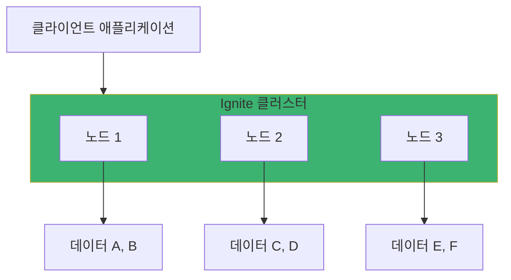
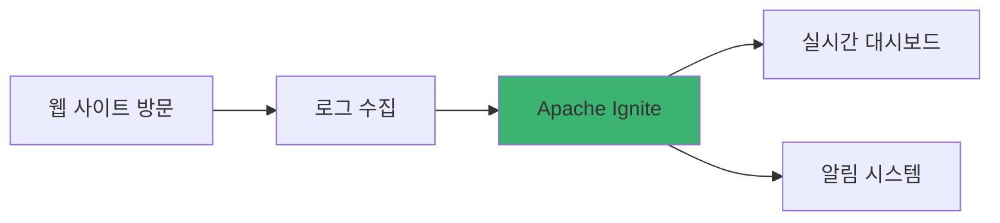
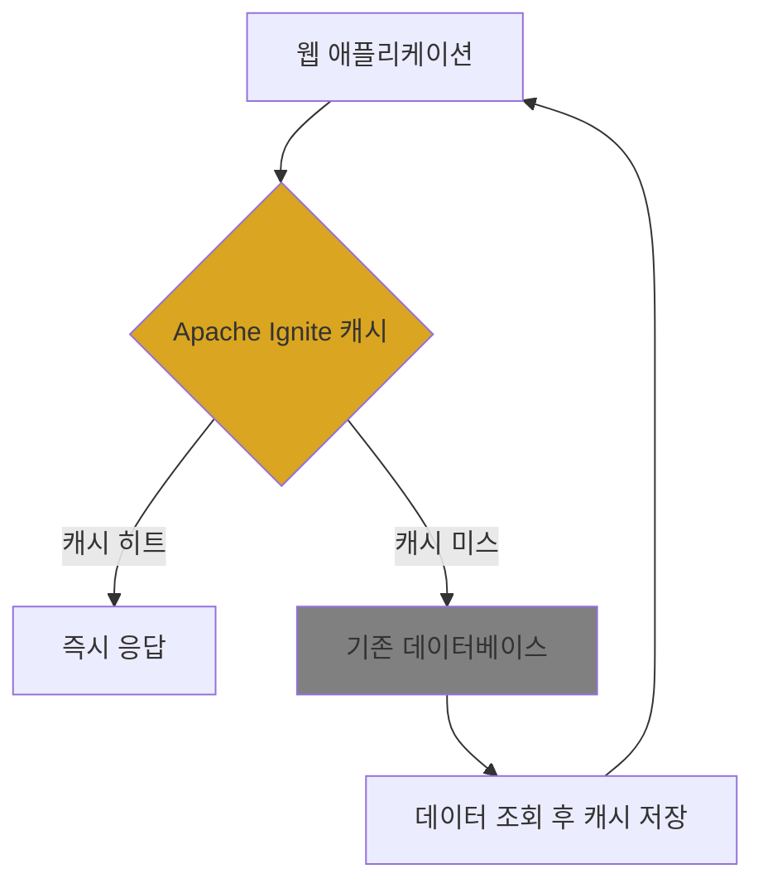

# Chapter 1: Apache Ignite 개요와 소개

## 📖 학습 목표
이 챕터를 완료하면 다음을 할 수 있습니다:
- Apache Ignite가 무엇인지 이해할 수 있습니다
- 전통적인 데이터베이스와 인메모리 데이터베이스의 차이점을 설명할 수 있습니다
- Apache Ignite의 주요 사용 사례를 파악할 수 있습니다
- 로컬 환경에 Apache Ignite를 설치하고 실행할 수 있습니다

## 📋 목차
1. Apache Ignite란?
2. 주요 특징과 장점
3. 사용 사례 및 적용 분야
4. 설치 및 환경 설정
5. 실습 예제
6. 확인 문제

---

## 1. Apache Ignite란?

### 개념 설명

Apache Ignite는 **인메모리 컴퓨팅 플랫폼**입니다. 쉽게 말해, 데이터를 디스크가 아닌 메모리(RAM)에 저장하고 처리하여 매우 빠른 성능을 제공하는 시스템입니다.

기존의 데이터베이스는 데이터를 하드디스크에 저장하고, 필요할 때마다 디스크에서 읽어오는 방식이었습니다. 하지만 Apache Ignite는 데이터를 메모리에 직접 저장하기 때문에 **수백 배에서 수천 배 빠른 성능**을 제공합니다.

### 전통적인 데이터베이스 vs Apache Ignite


### 왜 빠른가요?

메모리 접근 속도와 디스크 접근 속도의 차이를 간단히 비교해보면:
- **메모리 접근**: 0.1 마이크로초 (매우 빠름)
- **SSD 접근**: 100 마이크로초 (보통)
- **HDD 접근**: 10,000 마이크로초 (느림)

> **💡 팁**
> <div style="background-color: #daa520; padding: 10px; border-radius: 5px;">
> Node.js의 Express에서 변수를 메모리에 저장하는 것과 파일 시스템에 저장하는 것의 차이와 비슷합니다. 메모리는 즉시 접근 가능하지만, 파일은 읽고 쓰는 시간이 필요하죠.
> </div>

---

## 2. 주요 특징과 장점

### 핵심 특징

#### 1. 분산 아키텍처
Apache Ignite는 여러 서버(노드)에 데이터를 분산 저장할 수 있습니다.



#### 2. SQL 지원
기존 SQL 지식을 그대로 활용할 수 있습니다.

```sql
-- Apache Ignite에서 사용 가능한 표준 SQL
SELECT name, age FROM Person WHERE age > 25
```

#### 3. 다양한 언어 지원
- **Java** (가장 많이 사용)
- **C#/.NET**
- **C++**
- **Python**
- **Node.js** (REST API를 통해)

#### 4. 영속성 (Persistence) 지원
메모리 데이터를 디스크에도 저장하여 서버 재시작 후에도 데이터 유지 가능

### Spring Boot 개발자에게의 장점

기존에 Spring Boot + MySQL/PostgreSQL을 사용하던 개발자라면:

```java
// 기존 JPA 방식 (느림)
@Repository
public class UserRepository {
    @PersistenceContext
    private EntityManager em;
    
    public User findById(Long id) {
        // 데이터베이스 디스크에서 조회
        return em.find(User.class, id);
    }
}

// Apache Ignite 방식 (매우 빠름)
@Component
public class UserService {
    @Autowired
    private Ignite ignite;
    
    public User findById(Long id) {
        IgniteCache<Long, User> cache = ignite.cache("users");
        // 메모리에서 즉시 조회
        return cache.get(id);
    }
}
```

> **⚠️ 주의사항**
> <div style="background-color: #c35b5b; padding: 10px; border-radius: 5px;">
> 메모리는 디스크보다 용량이 작고 비쌉니다. 모든 데이터를 메모리에 저장할 필요는 없으며, 자주 사용되는 '핫 데이터'만 메모리에 저장하는 것이 일반적입니다.
> </div>

---

## 3. 사용 사례 및 적용 분야

### 적용하면 좋은 경우

#### 1. 실시간 분석이 필요한 경우


**예시**: 
- 전자상거래 사이트의 실시간 추천 시스템
- 게임의 실시간 랭킹 시스템
- 주식 거래의 실시간 가격 분석

#### 2. 캐싱 시스템
기존 데이터베이스 앞에 캐시 레이어로 사용



#### 3. 마이크로서비스 간 데이터 공유
여러 마이크로서비스가 공통으로 사용하는 데이터 저장소

### 실제 사용 사례

#### 1. 전자상거래
- **문제**: 상품 검색 시 느린 응답 속도
- **해결**: 인기 상품 정보를 Ignite에 캐싱
- **결과**: 검색 속도 10배 향상

#### 2. 금융 서비스
- **문제**: 실시간 위험 분석 필요
- **해결**: 거래 데이터를 Ignite에서 실시간 분석
- **결과**: 위험 탐지 시간 1분 → 1초로 단축

#### 3. 게임 서비스
- **문제**: 플레이어 세션 데이터 관리
- **해결**: 세션 정보를 Ignite 클러스터에 저장
- **결과**: 서버 재시작 시에도 세션 유지

---

## 4. 설치 및 환경 설정

### 시스템 요구사항
- **Java**: JDK 8 이상 (JDK 11 또는 17 권장)
- **메모리**: 최소 4GB RAM (8GB 이상 권장)
- **운영체제**: Windows, macOS, Linux 모두 지원

### macOS에서 설치하기

#### 1. Java 확인
```bash
# Java 버전 확인
java -version

# 만약 Java가 없다면 설치
brew install openjdk@11
```

#### 2. Apache Ignite 다운로드 및 설치
```bash
# Homebrew를 통한 설치 (가장 간단)
brew install apache-ignite

# 또는 직접 다운로드
wget https://downloads.apache.org/ignite/2.16.0/apache-ignite-2.16.0-bin.zip
unzip apache-ignite-2.16.0-bin.zip
cd apache-ignite-2.16.0-bin
```

#### 3. 환경 변수 설정
```bash
# ~/.zshrc 또는 ~/.bash_profile에 추가
export IGNITE_HOME=/usr/local/Cellar/apache-ignite/2.16.0/libexec
export PATH=$PATH:$IGNITE_HOME/bin
```

#### 4. Ignite 실행 확인
```bash
# Ignite 노드 실행
ignite.sh

# 성공시 다음과 같은 로그가 출력됩니다
# [INFO] Ignite node started OK (id=12345678)
```

### Maven 프로젝트 설정

Spring Boot 프로젝트에서 Apache Ignite를 사용하려면 `pom.xml`에 의존성을 추가해야 합니다.

```xml
<?xml version="1.0" encoding="UTF-8"?>
<project xmlns="http://maven.apache.org/POM/4.0.0">
    <modelVersion>4.0.0</modelVersion>
    
    <groupId>com.example</groupId>
    <artifactId>ignite-tutorial</artifactId>
    <version>1.0.0</version>
    <packaging>jar</packaging>
    
    <properties>
        <maven.compiler.source>11</maven.compiler.source>
        <maven.compiler.target>11</maven.compiler.target>
        <ignite.version>2.16.0</ignite.version>
    </properties>
    
    <dependencies>
        <!-- Apache Ignite 핵심 라이브러리 -->
        <dependency>
            <groupId>org.apache.ignite</groupId>
            <artifactId>ignite-core</artifactId>
            <version>${ignite.version}</version>
        </dependency>
        
        <!-- Spring Boot와의 통합을 위한 라이브러리 -->
        <dependency>
            <groupId>org.apache.ignite</groupId>
            <artifactId>ignite-spring</artifactId>
            <version>${ignite.version}</version>
        </dependency>
    </dependencies>
</project>
```

---

## 🔧 실습 예제

### 예제 1: 첫 번째 Ignite 애플리케이션

**목표**: Apache Ignite를 실행하고 간단한 데이터를 저장/조회해보기

**전제 조건**:
- Java 11 이상
- Maven
- IDE (IntelliJ IDEA 권장)

#### Java 코드 예제

```java
// 패키지 선언 - 프로젝트의 구조를 나타냄
package com.example.ignite.tutorial;

// 필요한 라이브러리 임포트
import org.apache.ignite.Ignite;          // Ignite 메인 인터페이스
import org.apache.ignite.Ignition;        // Ignite 인스턴스 생성 클래스
import org.apache.ignite.IgniteCache;     // 캐시 작업을 위한 인터페이스
import org.apache.ignite.configuration.IgniteConfiguration;  // 설정 클래스

/**
 * Apache Ignite 첫 번째 예제
 * - Ignite 노드를 시작합니다
 * - 간단한 데이터를 저장하고 조회합니다
 * - 리소스를 정리합니다
 */
public class FirstIgniteExample {
    
    public static void main(String[] args) {
        System.out.println("Apache Ignite 튜토리얼을 시작합니다!");
        
        // 1. Ignite 설정 생성 - 기본 설정 사용
        IgniteConfiguration cfg = new IgniteConfiguration();
        
        // 2. 클러스터 노드 이름 설정 (식별을 위해)
        cfg.setIgniteInstanceName("tutorial-node");
        
        // 3. Ignite 인스턴스 시작 - 이 시점에서 노드가 클러스터에 참여
        Ignite ignite = Ignition.start(cfg);
        
        try {
            System.out.println("Ignite 노드가 성공적으로 시작되었습니다!");
            
            // 4. 캐시 생성 또는 가져오기 - 'myCache'라는 이름의 캐시를 사용
            IgniteCache<String, String> cache = ignite.getOrCreateCache("myCache");
            
            // 5. 데이터 저장 - Key-Value 형태로 데이터 저장
            cache.put("hello", "Apache Ignite 안녕하세요!");
            cache.put("tutorial", "첫 번째 예제입니다.");
            cache.put("status", "실행 중");
            
            System.out.println("캐시에 데이터를 저장했습니다.");
            
            // 6. 데이터 조회 - 저장한 데이터를 키로 조회
            String hello = cache.get("hello");
            String tutorial = cache.get("tutorial");
            String status = cache.get("status");
            
            // 7. 결과 출력
            System.out.println("조회 결과:");
            System.out.println("hello: " + hello);
            System.out.println("tutorial: " + tutorial);
            System.out.println("status: " + status);
            
            // 8. 캐시 크기 확인
            System.out.println("캐시에 저장된 항목 수: " + cache.size());
            
        } catch (Exception e) {
            // 예외 발생 시 에러 메시지 출력
            System.err.println("오류가 발생했습니다: " + e.getMessage());
            e.printStackTrace();
        } finally {
            // 9. 리소스 정리 - 반드시 Ignite 인스턴스를 종료해야 합니다
            // 이를 통해 메모리 누수를 방지하고 클린한 종료가 가능합니다
            ignite.close();
            System.out.println("Ignite 노드가 정상적으로 종료되었습니다.");
        }
    }
}
```

#### 프로젝트 구조
```
src/
└── main/
    └── java/
        └── com/
            └── example/
                └── ignite/
                    └── tutorial/
                        └── FirstIgniteExample.java
```

**파일 위치 설명**:
- `src/main/java`: Java 소스 코드의 표준 Maven 디렉토리
- `com.example.ignite.tutorial`: 패키지명 (회사명.프로젝트명.모듈명 패턴)
- 이는 MVC 패턴에서 주로 **Service 또는 Model 계층**에 해당
- Spring Boot에서는 `@Service` 또는 `@Component` 어노테이션을 붙여 사용

#### 실행 결과 예상 출력
```
Apache Ignite 튜토리얼을 시작합니다!
Ignite 노드가 성공적으로 시작되었습니다!
캐시에 데이터를 저장했습니다.
조회 결과:
hello: Apache Ignite 안녕하세요!
tutorial: 첫 번째 예제입니다.
status: 실행 중
캐시에 저장된 항목 수: 3
Ignite 노드가 정상적으로 종료되었습니다.
```

### 예제 2: REST API를 통한 접근 (Node.js/React에서 활용)

Apache Ignite는 REST API를 제공하여 Java 외의 언어에서도 접근할 수 있습니다.

#### REST API 활성화 설정
```java
// Ignite 설정에 REST API 활성화 추가
IgniteConfiguration cfg = new IgniteConfiguration();

// REST API 커넥터 설정 
ConnectorConfiguration connectorCfg = new ConnectorConfiguration();
connectorCfg.setPort(8080);  // REST API 포트 설정
cfg.setConnectorConfiguration(connectorCfg);
```

#### JavaScript/Node.js에서 Ignite REST API 사용
```javascript
// Node.js Express 서버에서 Ignite REST API 호출 예제
const express = require('express');
const axios = require('axios');

const app = express();
const IGNITE_REST_URL = 'http://localhost:8080/ignite';

// Ignite에 데이터 저장
app.post('/api/cache/:key', async (req, res) => {
    try {
        const { key } = req.params;
        const { value } = req.body;
        
        // REST API를 통한 데이터 저장 요청
        const response = await axios.get(IGNITE_REST_URL, {
            params: {
                cmd: 'put',        // 저장 명령
                cacheName: 'myCache',
                key: key,
                val: value
            }
        });
        
        res.json({ success: true, result: response.data });
    } catch (error) {
        res.status(500).json({ error: error.message });
    }
});

// Ignite에서 데이터 조회
app.get('/api/cache/:key', async (req, res) => {
    try {
        const { key } = req.params;
        
        // REST API를 통한 데이터 조회 요청
        const response = await axios.get(IGNITE_REST_URL, {
            params: {
                cmd: 'get',        // 조회 명령
                cacheName: 'myCache',
                key: key
            }
        });
        
        res.json({ success: true, value: response.data.response });
    } catch (error) {
        res.status(500).json({ error: error.message });
    }
});

app.listen(3000, () => {
    console.log('Express 서버가 3000번 포트에서 실행 중입니다.');
});
```

#### React 컴포넌트에서 활용
```javascript
// React에서 Ignite 캐시를 사용하는 컴포넌트
import React, { useState, useEffect } from 'react';
import axios from 'axios';

const IgniteCacheComponent = () => {
    const [cacheKey, setCacheKey] = useState('');
    const [cacheValue, setCacheValue] = useState('');
    const [retrievedValue, setRetrievedValue] = useState('');
    const [loading, setLoading] = useState(false);
    
    // 캐시에 데이터 저장
    const saveToCache = async () => {
        if (!cacheKey || !cacheValue) return;
        
        setLoading(true);
        try {
            await axios.post(`/api/cache/${cacheKey}`, {
                value: cacheValue
            });
            alert('캐시에 데이터가 저장되었습니다!');
        } catch (error) {
            console.error('저장 실패:', error);
            alert('저장에 실패했습니다.');
        } finally {
            setLoading(false);
        }
    };
    
    // 캐시에서 데이터 조회
    const getFromCache = async () => {
        if (!cacheKey) return;
        
        setLoading(true);
        try {
            const response = await axios.get(`/api/cache/${cacheKey}`);
            setRetrievedValue(response.data.value || '데이터 없음');
        } catch (error) {
            console.error('조회 실패:', error);
            setRetrievedValue('조회 실패');
        } finally {
            setLoading(false);
        }
    };
    
    return (
        <div style={{ padding: '20px' }}>
            <h2>Apache Ignite 캐시 테스트</h2>
            
            <div style={{ marginBottom: '20px' }}>
                <input
                    type="text"
                    placeholder="캐시 키를 입력하세요"
                    value={cacheKey}
                    onChange={(e) => setCacheKey(e.target.value)}
                    style={{ marginRight: '10px', padding: '8px' }}
                />
                <input
                    type="text"
                    placeholder="저장할 값을 입력하세요"
                    value={cacheValue}
                    onChange={(e) => setCacheValue(e.target.value)}
                    style={{ marginRight: '10px', padding: '8px' }}
                />
                <button 
                    onClick={saveToCache} 
                    disabled={loading}
                    style={{ padding: '8px 16px', marginRight: '10px' }}
                >
                    저장
                </button>
                <button 
                    onClick={getFromCache} 
                    disabled={loading}
                    style={{ padding: '8px 16px' }}
                >
                    조회
                </button>
            </div>
            
            {loading && <p>처리 중...</p>}
            
            {retrievedValue && (
                <div style={{ 
                    backgroundColor: '#3cb371', 
                    padding: '10px', 
                    borderRadius: '5px',
                    marginTop: '10px'
                }}>
                    <strong>조회 결과:</strong> {retrievedValue}
                </div>
            )}
        </div>
    );
};

export default IgniteCacheComponent;
```

---

## ✅ 확인 문제

### 문제 1 (단일 선택)
Apache Ignite가 전통적인 데이터베이스보다 빠른 주된 이유는 무엇인가요?

1. 더 효율적인 압축 알고리즘을 사용하기 때문
2. 데이터를 메모리(RAM)에 저장하기 때문
3. 더 강력한 CPU를 사용하기 때문
4. 더 적은 데이터를 저장하기 때문

### 문제 2 (복수 선택)
Apache Ignite의 주요 특징으로 올바른 것을 모두 선택하세요.

1. 분산 아키텍처 지원
2. SQL 쿼리 지원
3. Java에서만 사용 가능
4. 메모리와 디스크 영속성 모두 지원

### 문제 3 (단일 선택)
Spring Boot 애플리케이션에서 Apache Ignite를 사용하기 위해 pom.xml에 추가해야 하는 의존성은?

1. spring-boot-starter-data-ignite
2. ignite-core
3. apache-ignite-spring
4. ignite-spring-boot-starter

### 문제 4 (단일 선택)
다음 중 Apache Ignite를 사용하면 가장 효과적인 사용 사례는?

1. 한 달에 한 번 실행되는 배치 작업
2. 실시간 게임 랭킹 시스템
3. 장기 보관용 아카이브 데이터
4. 단순한 정적 웹 사이트

### 문제 5 (실습 문제)
다음 Java 코드에서 빈 칸에 들어갈 올바른 코드를 선택하세요.

```java
public class IgniteExample {
    public static void main(String[] args) {
        Ignite ignite = Ignition.start();
        _________ cache = ignite.getOrCreateCache("testCache");
        cache.put("key1", "value1");
        String result = cache.get("key1");
        ignite.close();
    }
}
```

1. IgniteCache<String, String>
2. Map<String, String>
3. Cache<String, String>
4. HashMap<String, String>

---

## 📚 정리

### 핵심 내용 요약
- **Apache Ignite는 인메모리 컴퓨팅 플랫폼**으로 데이터를 메모리에 저장하여 매우 빠른 성능을 제공합니다
- **분산 아키텍처, SQL 지원, 다양한 언어 지원**이 주요 특징입니다
- **캐싱, 실시간 분석, 마이크로서비스 데이터 공유** 등에 효과적입니다
- **Java 프로젝트에서는 Maven 의존성**을, **웹 애플리케이션에서는 REST API**를 통해 활용할 수 있습니다

### 다음 챕터 준비
다음 챕터에서는 Apache Ignite의 **메모리 아키텍처와 데이터 그리드**에 대해 더 자세히 학습합니다. 데이터가 어떻게 메모리에 저장되고 관리되는지, 그리고 분산 환경에서 어떻게 동작하는지 알아보겠습니다.

---

## 🔗 참고 자료
- [Apache Ignite 공식 문서 - Getting Started](https://ignite.apache.org/docs/latest/quick-start/java)
- [Apache Ignite REST API 문서](https://ignite.apache.org/docs/latest/restapi)
- [Spring Boot와 Ignite 통합 가이드](https://ignite.apache.org/docs/latest/extensions-and-integrations/spring/spring-boot)
