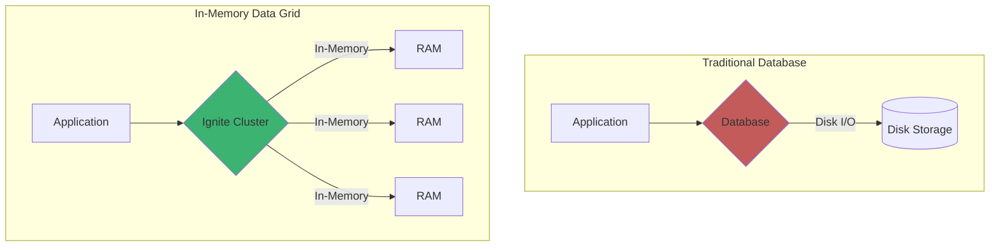
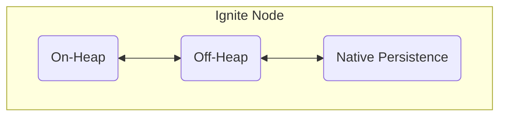
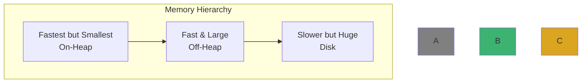
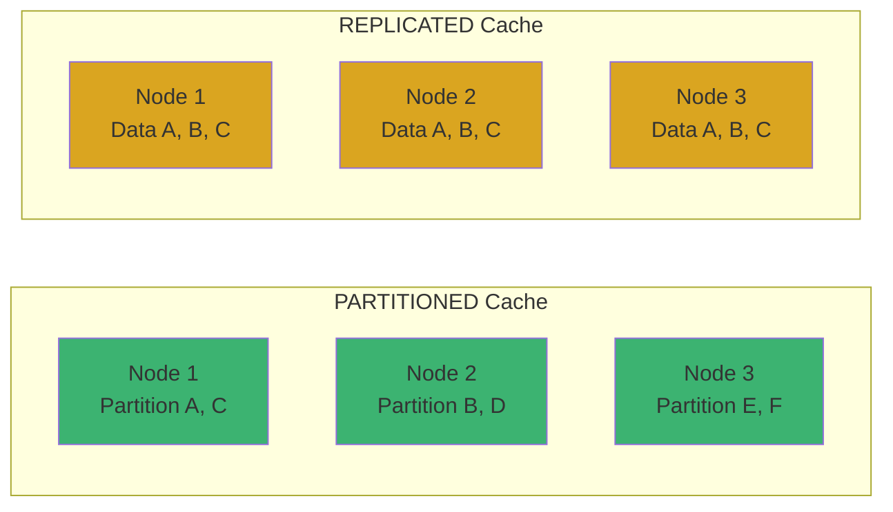
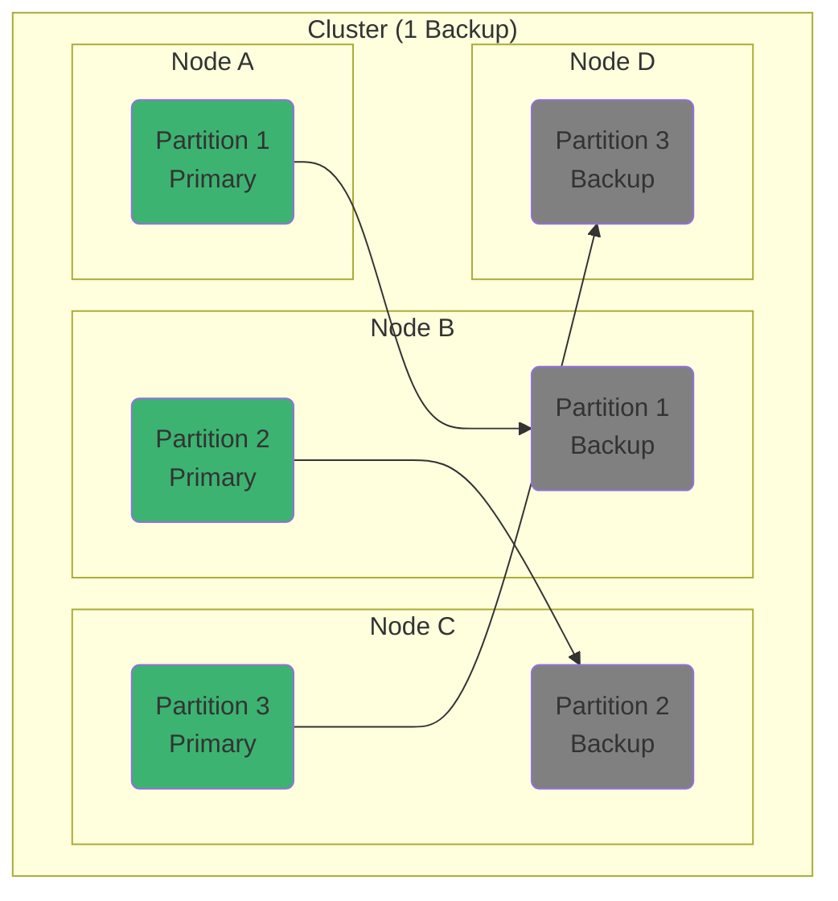

# Chapter 2: 메모리 아키텍처와 데이터 그리드

## 📖 학습 목표
이 챕터를 완료하면 다음을 할 수 있습니다:
- 인메모리 데이터 그리드(IMDG)의 기본 개념을 설명할 수 있습니다.
- Apache Ignite의 다계층 메모리 아키텍처를 이해할 수 있습니다.
- Ignite의 다양한 캐시 모드와 데이터 저장 방식을 설명할 수 있습니다.
- 데이터 분산과 고가용성을 위한 파티셔닝과 복제 개념을 이해할 수 있습니다.

## 📋 목차
1. 인메모리 데이터 그리드(IMDG)란?
2. Ignite의 메모리 아키텍처
3. 캐시와 데이터 저장 방식
4. 파티셔닝과 복제
5. 확인 문제

---

## 1. 인메모리 데이터 그리드(IMDG)란?

### 개념 설명
**인메모리 데이터 그리드(In-Memory Data Grid, IMDG)**는 컴퓨터의 주 메모리(RAM)에 데이터를 저장하여 매우 빠른 속도로 데이터에 접근하고 처리할 수 있도록 설계된 데이터 저장 시스템입니다.

전통적인 데이터베이스는 디스크(HDD, SSD)에 데이터를 저장합니다. 디스크에서 데이터를 읽고 쓰는 작업은 메모리에서 처리하는 것보다 훨씬 느립니다. IMDG는 데이터를 메모리에 분산시켜 저장함으로써 디스크 I/O 병목 현상을 제거하고, 애플리케이션의 성능을 극적으로 향상시킵니다.

React나 Node.js 환경에서 `Redis`를 캐시 서버로 사용해 본 경험이 있다면, 비슷한 개념으로 이해할 수 있습니다. 하지만 Ignite와 같은 IMDG는 단순한 캐시를 넘어 데이터 분산, 연산, 트랜잭션 등 더 복잡한 기능을 클러스터 환경에서 제공합니다.

### 시각적 자료


> **💡 팁: IMDG는 언제 사용할까요?**
> <div style="background-color: #daa520; padding: 10px; border-radius: 5px;">
> 대규모 데이터 처리, 실시간 분석, 고성능 컴퓨팅, 금융 서비스 등 빠른 응답 속도가 비즈니스에 결정적인 영향을 미치는 시스템에 주로 사용됩니다. 예를 들어, 실시간으로 변동되는 주식 가격을 조회하거나, 수많은 사용자가 동시에 접속하는 게임 서버의 상태를 관리하는 데 효과적입니다.
> </div>

---

## 2. Ignite의 메모리 아키텍처

Apache Ignite는 **'Durable Memory'**라는 독자적인 다계층 메모리 아키텍처를 사용합니다. 이는 단순히 메모리에만 데이터를 두는 것을 넘어, 디스크에도 데이터를 저장하여 영속성을 보장하는 강력한 기능입니다.

### 다계층 메모리 구조
Ignite의 메모리는 크게 세 가지 계층으로 나뉩니다.

1.  **On-Heap (JVM 힙 메모리)**: Java의 가비지 컬렉션(GC)이 관리하는 영역입니다. 접근 속도가 가장 빠르지만, GC로 인한 성능 저하(Stop-the-world)가 발생할 수 있어 대용량 데이터를 저장하기에는 적합하지 않습니다.
2.  **Off-Heap (메인 메모리)**: JVM 힙 외부의 메모리 영역으로, Ignite가 직접 관리합니다. GC의 영향을 받지 않아 예측 가능한 성능을 제공하며, 대용량 데이터를 저장하는 데 사용됩니다.
3.  **Native Persistence (디스크)**: 메모리 용량을 초과하는 데이터를 디스크(SSD, HDD)에 저장하여 영속성을 보장합니다. 클러스터가 재시작되어도 데이터가 유실되지 않으며, 메모리를 '캐시'처럼 활용하여 빠른 접근을 지원합니다.

### 시각적 자료



> **⚠️ 주의사항: On-Heap과 Off-Heap 선택**
> <div style="background-color: #c35b5b; padding: 10px; border-radius: 5px;">
> Node.js 개발자에게는 메모리 관리가 생소할 수 있습니다. Java에서는 JVM의 GC가 성능에 큰 영향을 미칩니다. Ignite에서는 대부분의 데이터를 **Off-Heap**에 저장하는 것이 권장됩니다. 이를 통해 GC 오버헤드를 최소화하고 안정적인 성능을 확보할 수 있습니다. On-Heap은 작은 양의 데이터를 빠르게 처리해야 할 때 제한적으로 사용합니다.
> </div>

---

## 3. 캐시와 데이터 저장 방식

Ignite에서 데이터는 **캐시(Cache)**라는 논리적인 단위로 저장 및 관리됩니다. 이는 관계형 데이터베이스의 '테이블'과 유사한 개념으로 생각할 수 있습니다. 각 캐시는 고유한 이름을 가지며, Key-Value 형태로 데이터를 저장합니다.

### 캐시 모드 (Cache Mode)
캐시를 생성할 때 데이터 분산 및 복제 방식을 결정하는 '캐시 모드'를 설정해야 합니다.

1.  **PARTITIONED (분산 캐시)**
    -   가장 일반적으로 사용되는 모드입니다.
    -   전체 데이터를 여러 파티션으로 나누어 클러스터 내의 여러 노드에 분산하여 저장합니다.
    -   이를 통해 클러스터의 전체 메모리 용량을 활용할 수 있어 확장성이 매우 뛰어납니다.
    -   특정 데이터는 해당 데이터가 저장된 노드에 직접 접근해야 합니다.

2.  **REPLICATED (복제 캐시)**
    -   데이터를 모든 노드에 복제하여 저장합니다.
    -   어떤 노드에서든 데이터를 매우 빠르게 읽을 수 있다는 장점이 있습니다.
    -   데이터를 수정할 때마다 모든 노드에 변경 사항을 전파해야 하므로 쓰기 성능이 저하될 수 있습니다.
    -   자주 조회되지만 자주 변경되지 않는 작은 규모의 데이터(예: 설정 정보, 코드 데이터)에 적합합니다.

### 시각적 자료


> **✅ 성공 포인트: 어떤 캐시 모드를 선택해야 할까?**
> <div style="background-color: #3cb371; padding: 10px; border-radius: 5px;">
> - **대용량 데이터**이고 **확장성**이 중요하다면 `PARTITIONED` 모드를 사용하세요. 대부분의 경우가 여기에 해당합니다.
> - 데이터 크기가 **작고**, **읽기 작업이 빈번**하며, 데이터 변경이 거의 없다면 `REPLICATED` 모드를 고려해볼 수 있습니다.
> </div>

---

## 4. 파티셔닝과 복제

### 파티셔닝 (Partitioning)
`PARTITIONED` 캐시에서 데이터가 클러스터 전체에 분산되는 방식을 **파티셔닝**이라고 합니다. Ignite는 Key를 해시(hash)하여 어떤 파티션에 저장될지 결정합니다. 각 파티션은 특정 노드에 할당됩니다. 이를 통해 데이터가 클러스터에 고르게 분산되고, 특정 노드에 부하가 집중되는 것을 방지합니다.

### 복제 (Replication / Backups)
데이터의 안정성을 위해 Ignite는 각 파티션의 복제본(backup)을 다른 노드에 저장할 수 있습니다. 만약 특정 노드에 장애가 발생하더라도 다른 노드에 저장된 복제본을 통해 데이터 유실 없이 서비스를 계속할 수 있습니다. 복제본의 개수는 캐시 설정에서 지정할 수 있습니다.

-   **Primary Node**: 파티션의 원본 데이터를 소유하고 읽기/쓰기 연산을 처리하는 노드.
-   **Backup Node**: Primary 노드의 데이터 복제본을 소유하는 노드.

### 시각적 자료


> **💡 팁: 고가용성(High Availability)**
> <div style="background-color: #daa520; padding: 10px; border-radius: 5px;">
> 이처럼 파티셔닝과 복제 기능을 통해 Ignite는 일부 노드에 장애가 발생하더라도 전체 시스템은 중단 없이 동작하는 **고가용성**을 제공합니다. 이는 24시간 365일 안정적인 서비스가 필수적인 시스템에서 매우 중요한 특징입니다.
> </div>

---

## ✅ 확인 문제

### 문제 1 (단일 선택)
Ignite의 메모리 아키텍처에서 GC(Garbage Collection)의 영향을 최소화하고 예측 가능한 성능을 위해 대부분의 데이터를 저장하는 것이 권장되는 메모리 계층은 무엇입니까?

1. On-Heap
2. Off-Heap
3. Native Persistence
4. JVM Stack

### 문제 2 (복수 선택)
`REPLICATED` 캐시 모드의 특징으로 올바른 것을 모두 선택하세요.

1. 클러스터의 모든 노드에 데이터 전체를 복제하여 저장한다.
2. 대용량 데이터를 저장하고 확장성을 확보하는 데 가장 유리하다.
3. 데이터 수정 시 모든 노드에 변경 사항을 전파해야 하므로 쓰기 성능이 저하될 수 있다.
4. 데이터 조회 속도가 매우 빠르다.

### 문제 3 (단일 선택)
데이터를 여러 부분으로 나누어 클러스터의 여러 노드에 분산 저장하는 기술을 무엇이라고 합니까?

1. 복제 (Replication)
2. 파티셔닝 (Partitioning)
3. 영속성 (Persistence)
4. 트랜잭션 (Transaction)

---

## 📚 정리

### 핵심 내용 요약
- **인메모리 데이터 그리드(IMDG)**는 데이터를 메모리에 저장하여 빠른 속도를 제공하는 시스템입니다.
- Ignite는 **On-Heap, Off-Heap, Native Persistence**로 구성된 다계층 메모리 아키텍처를 가집니다.
- 데이터는 **캐시** 단위로 관리되며, `PARTITIONED`와 `REPLICATED` 모드를 통해 분산/복제 방식을 설정할 수 있습니다.
- **파티셔닝**은 데이터 분산을, **복제**는 데이터 안정성을 보장하여 고가용성을 제공합니다.

### 다음 챕터 준비
다음 챕터에서는 **Java 애플리케이션과 Ignite를 통합**하는 방법에 대해 학습합니다. Ignite 클라이언트를 설정하고 기본적인 데이터 CRUD(생성, 읽기, 수정, 삭제) 작업을 수행하는 실습을 진행할 것입니다.

---

## 🔧 실습 예제: Ignite 메모리 아키텍처 설정 (Java/Spring, Kotlin/Spring)

### Java(Spring) 예제
```java
// 파일 경로: src/main/java/com/example/ignite/MemoryConfig.java
package com.example.ignite;

import org.apache.ignite.Ignite;
import org.apache.ignite.Ignition;
import org.apache.ignite.configuration.DataRegionConfiguration;
import org.apache.ignite.configuration.IgniteConfiguration;

public class MemoryConfig {
    public static void main(String[] args) {
        // IgniteConfiguration 객체 생성
        IgniteConfiguration cfg = new IgniteConfiguration();

        // DataRegionConfiguration: Off-Heap 메모리 영역 설정
        DataRegionConfiguration regionCfg = new DataRegionConfiguration();
        regionCfg.setName("offheap-region"); // 데이터 영역 이름 지정
        regionCfg.setInitialSize(256 * 1024 * 1024); // 초기 크기: 256MB
        regionCfg.setMaxSize(1024 * 1024 * 1024); // 최대 크기: 1GB
        regionCfg.setPersistenceEnabled(true); // 디스크 영속성 활성화

        // Ignite에 데이터 영역 추가
        cfg.setDataRegionConfigurations(regionCfg);

        // Ignite 노드 시작
        try (Ignite ignite = Ignition.start(cfg)) {
            System.out.println("Ignite started with custom memory configuration.");
            // ...여기에 캐시 생성 및 데이터 저장 코드 추가 가능...
        }
    }
}
```

### Kotlin(Spring) 예제
```kotlin
// 파일 경로: src/main/kotlin/com/example/ignite/MemoryConfig.kt
package com.example.ignite

import org.apache.ignite.Ignition
import org.apache.ignite.configuration.DataRegionConfiguration
import org.apache.ignite.configuration.IgniteConfiguration

fun main() {
    // IgniteConfiguration 객체 생성
    val cfg = IgniteConfiguration()

    // DataRegionConfiguration: Off-Heap 메모리 영역 설정
    val regionCfg = DataRegionConfiguration().apply {
        name = "offheap-region" // 데이터 영역 이름 지정
        initialSize = 256 * 1024 * 1024 // 초기 크기: 256MB
        maxSize = 1024 * 1024 * 1024 // 최대 크기: 1GB
        isPersistenceEnabled = true // 디스크 영속성 활성화
    }

    // Ignite에 데이터 영역 추가
    cfg.dataRegionConfigurations = arrayOf(regionCfg)

    // Ignite 노드 시작
    Ignition.start(cfg).use {
        println("Ignite started with custom memory configuration.")
        // ...여기에 캐시 생성 및 데이터 저장 코드 추가 가능...
    }
}
```

> **파일 위치 설명**: SpringBoot 프로젝트의 표준 구조에 따라, 설정 및 예제 코드는 src/main/java 또는 src/main/kotlin 하위에 위치합니다. 이는 패키지 관리와 빌드 자동화, 유지보수에 유리합니다.

---
