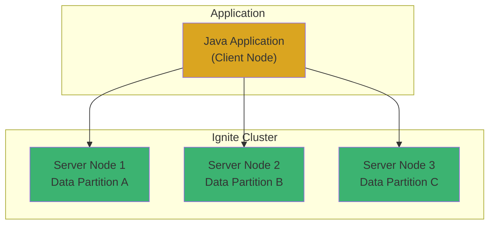
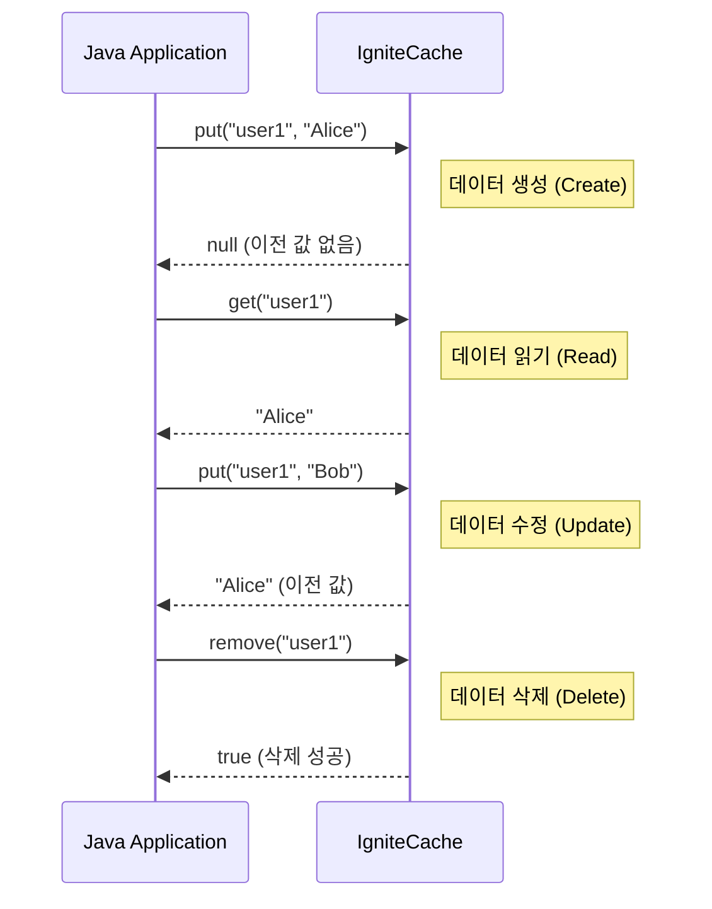

# Chapter 3: Java 애플리케이션과 Ignite 통합

## 📖 학습 목표
이 챕터를 완료하면 다음을 할 수 있습니다:
- Java 애플리케이션에서 Ignite 클러스터에 연결할 수 있습니다.
- Ignite 캐시에 대해 기본적인 CRUD(Create, Read, Update, Delete) 작업을 수행할 수 있습니다.
- 데이터의 일관성을 보장하기 위해 트랜잭션을 사용할 수 있습니다.
- SQL을 사용하여 Ignite에 저장된 데이터를 쿼리할 수 있습니다.

## 📋 목차
1. Java 클라이언트 설정
2. 기본 CRUD 작업
3. 트랜잭션 처리
4. SQL 쿼리 활용
5. 실습 예제: 간단한 회원 관리 애플리케이션
6. 확인 문제

---

## 1. Java 클라이언트 설정

Java 애플리케이션에서 Ignite 클러스터와 통신하려면 **클라이언트 노드(Client Node)**를 사용해야 합니다. 클라이언트 노드는 클러스터의 일부로 참여하지만, 데이터를 저장하거나 연산을 직접 수행하지는 않고 클러스터에 작업을 요청하는 역할만 합니다.

### 클라이언트 노드 vs 서버 노드
- **서버 노드 (Server Node)**: 실제 데이터를 저장하고, 연산을 수행하며, 클러스터의 핵심 멤버입니다.
- **클라이언트 노드 (Client Node)**: 경량화된 노드로, 서버 노드에 연결하여 데이터 요청, 연산 제출 등의 작업을 수행합니다. 애플리케이션은 보통 클라이언트 노드를 통해 클러스터에 접근합니다.

### 시각적 자료


### Maven/Gradle 의존성 추가
Java 프로젝트에서 Ignite를 사용하려면 `ignite-core` 라이브러리를 추가해야 합니다.

**Maven (`pom.xml`)**
```xml
<dependencies>
    <dependency>
        <groupId>org.apache.ignite</groupId>
        <artifactId>ignite-core</artifactId>
        <version>2.16.0</version> <!-- 작성일 기준 최신 LTS 버전 -->
    </dependency>
</dependencies>
```

**Gradle (`build.gradle`)**
```groovy
dependencies {
    implementation 'org.apache.ignite:ignite-core:2.16.0'
}
```

> **💡 팁: Spring Boot와의 통합**
> <div style="background-color: #daa520; padding: 10px; border-radius: 5px;">
> Spring Boot 환경에서는 `ignite-spring-boot-starter`를 사용하면 더 편리하게 Ignite를 설정하고 통합할 수 있습니다. 이 스타터는 필요한 설정을 자동으로 구성해주는 `@EnableIgniteRepositories` 같은 어노테이션을 제공합니다.
> </div>

---

## 2. 기본 CRUD 작업

CRUD는 데이터베이스 시스템의 가장 기본적인 네 가지 기능인 **Create(생성), Read(읽기), Update(수정), Delete(삭제)**를 의미합니다. Ignite 캐시는 `IgniteCache` 인터페이스를 통해 이러한 기능을 직관적으로 제공합니다.

### 캐시 인스턴스 얻기
먼저, 작업을 수행할 캐시의 인스턴스를 얻어야 합니다. `ignite.getOrCreateCache("cacheName")` 메서드를 사용하면 지정된 이름의 캐시가 없으면 새로 생성하고, 있으면 기존 캐시를 가져옵니다.

### CRUD 메서드
- **Create/Update**: `put(key, value)` - 키에 해당하는 값을 저장합니다. 이미 키가 존재하면 값을 덮어씁니다.
- **Read**: `get(key)` - 키에 해당하는 값을 읽어옵니다.
- **Delete**: `remove(key)` - 키에 해당하는 데이터를 삭제합니다.

### 시각적 자료


---

## 3. 트랜잭션 처리

**트랜잭션(Transaction)**은 여러 개의 작업을 하나의 논리적인 단위로 묶어서 처리하는 기능입니다. 모든 작업이 성공적으로 완료되어야만 최종적으로 데이터를 변경하며, 중간에 하나라도 실패하면 모든 작업을 이전 상태로 되돌립니다(Rollback). 이는 **데이터의 원자성(Atomicity)과 일관성(Consistency)**을 보장하는 매우 중요한 기능입니다.

예를 들어, A 계좌에서 B 계좌로 돈을 이체하는 경우 'A 계좌 출금'과 'B 계좌 입금'은 반드시 함께 성공하거나 함께 실패해야 합니다.

### Ignite 트랜잭션 사용법
1.  `ignite.transactions()`를 통해 트랜잭션 객체를 얻습니다.
2.  `tx.start()`로 트랜잭션을 시작합니다.
3.  `try-with-resources` 구문을 사용하면 코드가 간결해지고, 트랜잭션이 자동으로 종료(commit 또는 rollback)되도록 보장할 수 있습니다.
4.  `tx.commit()`을 호출하여 모든 변경사항을 최종 적용합니다.
5.  예외가 발생하면 `tx.rollback()`을 호출하여 모든 변경사항을 취소합니다.

> **⚠️ 주의사항: 트랜잭션과 성능**
> <div style="background-color: #c35b5b; padding: 10px; border-radius: 5px;">
> 트랜잭션은 데이터의 안정성을 높여주지만, 여러 노드 간의 데이터 동기화를 위한 잠금(Locking) 메커니즘을 사용하므로 성능 저하를 유발할 수 있습니다. 따라서 꼭 필요한 경우에만, 그리고 트랜잭션 범위를 최대한 짧게 유지하는 것이 좋습니다.
> </div>

---

## 4. SQL 쿼리 활용

Ignite는 Key-Value 저장소일 뿐만 아니라, 분산된 데이터에 대해 표준 **SQL 쿼리**를 실행할 수 있는 강력한 기능을 제공합니다. 이를 통해 복잡한 조건으로 데이터를 검색하거나, 여러 데이터를 조인하는 등 관계형 데이터베이스처럼 데이터를 다룰 수 있습니다.

### SQL 쿼리 실행
- `SqlFieldsQuery` 객체를 생성하여 실행할 SQL 문을 설정합니다.
- 캐시의 `query()` 메서드를 호출하여 쿼리를 실행합니다.
- 쿼리 결과는 리스트 형태로 반환되며, 각 행의 필드에 인덱스로 접근할 수 있습니다.

### 인덱싱 (Indexing)
SQL 쿼리의 성능을 높이려면 반드시 **인덱스**를 생성해야 합니다. 인덱스가 없으면 쿼리가 실행될 때마다 모든 데이터를 스캔(Full Scan)해야 하므로 성능이 크게 저하됩니다.
`@QuerySqlField` 어노테이션을 사용하여 값 객체(Value Object)의 특정 필드에 인덱스를 설정할 수 있습니다.

> **✅ 성공 포인트: SQL을 사용해야 하는 이유**
> <div style="background-color: #3cb371; padding: 10px; border-radius: 5px;">
> Key-Value 기반의 `get()`은 단일 데이터를 가져올 때 가장 빠릅니다. 하지만 '나이가 30 이상인 모든 사용자 찾기'와 같이 특정 조건에 맞는 여러 데이터를 검색해야 할 때는 SQL 쿼리가 훨씬 효율적이고 편리합니다.
> </div>

---

## 🔧 실습 예제: 간단한 회원 관리 애플리케이션

### 목표
- `Member` 객체를 Ignite 캐시에 저장하고 관리합니다.
- ID로 회원을 조회하고, 나이로 회원을 검색하는 기능을 구현합니다.

#### 1. `Member` 클래스 정의
회원 정보를 담을 `Member` 클래스를 만듭니다. SQL 쿼리를 위해 `@QuerySqlField`로 인덱스를 설정합니다.

```java
// 파일 경로: src/main/java/com/example/ignite/model/Member.java
package com.example.ignite.model;

import org.apache.ignite.cache.query.annotations.QuerySqlField;
import java.io.Serializable;

// Serializable 인터페이스는 객체가 다른 JVM이나 네트워크로 전송될 수 있도록 직렬화를 허용합니다.
public class Member implements Serializable {

    // age 필드에 인덱스를 생성합니다. 이렇게 하면 나이를 조건으로 하는 SQL 쿼리 성능이 향상됩니다.
    @QuerySqlField(index = true)
    private int age;

    private String name;

    // 생성자
    public Member(int age, String name) {
        this.age = age;
        this.name = name;
    }

    // Getter 메서드들
    public int getAge() { return age; }
    public String getName() { return name; }

    @Override
    public String toString() {
        return "Member [name=" + name + ", age=" + age + "]";
    }
}
```

#### 2. 메인 애플리케이션 작성

```java
// 파일 경로: src/main/java/com/example/ignite/Chapter3Example.java
package com.example.ignite;

import com.example.ignite.model.Member;
import org.apache.ignite.Ignite;
import org.apache.ignite.IgniteCache;
import org.apache.ignite.Ignition;
import org.apache.ignite.cache.CacheMode;
import org.apache.ignite.cache.query.SqlFieldsQuery;
import org.apache.ignite.configuration.CacheConfiguration;
import org.apache.ignite.configuration.IgniteConfiguration;

import java.util.List;

public class Chapter3Example {

    public static void main(String[] args) {
        // 1. Ignite 설정 및 클라이언트 노드 시작
        IgniteConfiguration cfg = new IgniteConfiguration();
        cfg.setClientMode(true); // 클라이언트 모드로 설정

        try (Ignite ignite = Ignition.start(cfg)) {
            // 2. 캐시 설정 및 생성
            CacheConfiguration<Long, Member> cacheCfg = new CacheConfiguration<>();
            cacheCfg.setName("memberCache");
            cacheCfg.setCacheMode(CacheMode.PARTITIONED); // 분산 캐시 모드 사용
            cacheCfg.setIndexedTypes(Long.class, Member.class); // SQL 쿼리를 위해 타입과 인덱스 설정

            IgniteCache<Long, Member> memberCache = ignite.getOrCreateCache(cacheCfg);

            // 3. CRUD 작업 예제
            System.out.println("--- CRUD Operations ---");
            // Create
            memberCache.put(1L, new Member(30, "Alice"));
            memberCache.put(2L, new Member(25, "Bob"));
            // Read
            Member member = memberCache.get(1L);
            System.out.println("Read Member(1L): " + member);
            // Update
            memberCache.put(1L, new Member(31, "Alice"));
            System.out.println("Updated Member(1L): " + memberCache.get(1L));
            // Delete
            memberCache.remove(2L);
            System.out.println("Member(2L) exists after remove: " + memberCache.containsKey(2L));

            // 4. SQL 쿼리 예제
            System.out.println("\n--- SQL Query ---");
            // 30세 이상인 회원을 검색하는 SQL 쿼리
            String sql = "select name, age from Member where age >= ?";
            SqlFieldsQuery query = new SqlFieldsQuery(sql).setArgs(30); // '?' 파라미터에 30을 바인딩

            // 쿼리 실행
            List<List<?>> results = memberCache.query(query).getAll();

            // 결과 출력
            for (List<?> row : results) {
                System.out.println("Found Member: name=" + row.get(0) + ", age=" + row.get(1));
            }
        }
    }
}
```

---

## ✅ 확인 문제

### 문제 1 (단일 선택)
Java 애플리케이션에서 Ignite 클러스터에 연결할 때, 데이터를 직접 저장하지 않고 작업 요청만 보내는 역할의 노드는 무엇입니까?

1. 서버 노드 (Server Node)
2. 마스터 노드 (Master Node)
3. 데이터 노드 (Data Node)
4. 클라이언트 노드 (Client Node)

### 문제 2 (복수 선택)
Ignite 캐시의 CRUD 작업에 대한 설명으로 올바른 것을 모두 선택하세요.

1. `get(key)`는 키에 해당하는 값을 읽어온다.
2. `create(key, value)`는 새로운 데이터를 생성한다.
3. `put(key, value)`는 데이터 생성과 수정에 모두 사용된다.
4. `delete(key)`는 키에 해당하는 데이터를 삭제한다.

### 문제 3 (단일 선택)
여러 개의 데이터베이스 작업을 하나의 논리적 단위로 묶어 데이터의 일관성을 보장하는 기능은 무엇입니까?

1. 쿼리 (Query)
2. 인덱스 (Index)
3. 트랜잭션 (Transaction)
4. 프로시저 (Procedure)

---

## 📚 정리

### 핵심 내용 요약
- Java 애플리케이션은 **클라이언트 노드**를 통해 Ignite 클러스터에 안전하게 연결할 수 있습니다.
- `IgniteCache` 인터페이스는 `put`, `get`, `remove` 등 직관적인 **CRUD** 메서드를 제공합니다.
- **트랜잭션**을 사용하면 여러 작업을 원자적으로 처리하여 데이터의 일관성을 보장할 수 있습니다.
- **SQL 쿼리**와 **인덱싱**을 통해 관계형 데이터베이스처럼 복잡한 조건으로 데이터를 효율적으로 검색할 수 있습니다.

### 다음 챕터 준비
다음 챕터에서는 **웹 애플리케이션과의 통합**에 대해 알아봅니다. Ignite가 제공하는 **REST API**를 사용하여 JavaScript나 React 같은 웹 프론트엔드에서 어떻게 Ignite 데이터에 접근하고 활용할 수 있는지 학습합니다.
