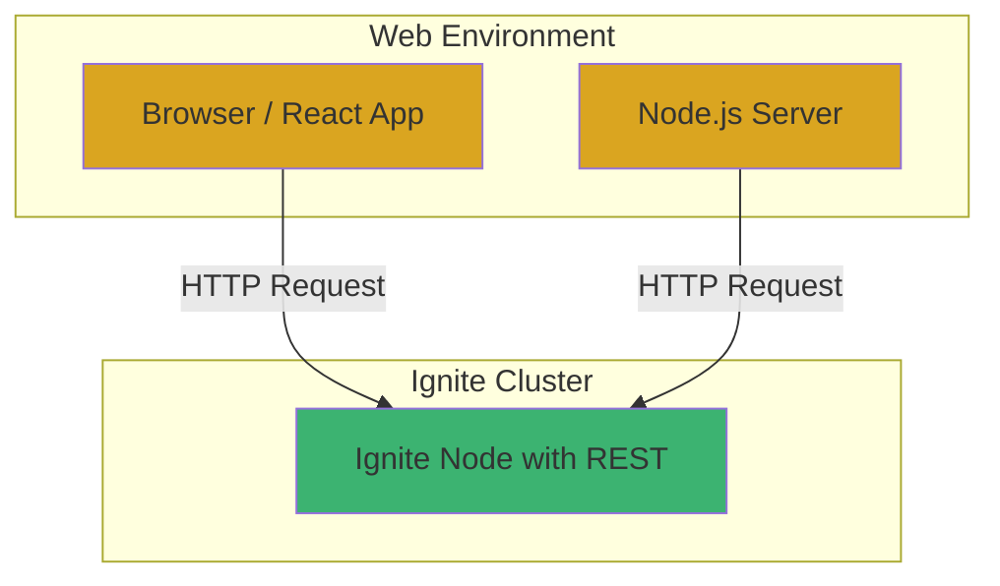

# Chapter 4: 웹 애플리케이션 통합 (REST API & JavaScript)

## 📖 학습 목표
이 챕터를 완료하면 다음을 할 수 있습니다:
- Ignite의 내장 REST API를 활성화하고 사용할 수 있습니다.
- JavaScript/Node.js 환경에서 REST API를 통해 Ignite 데이터에 접근할 수 있습니다.
- React 애플리케이션에서 Ignite 데이터를 조회하고 표시할 수 있습니다.
- 웹소켓(WebSocket)을 이용한 실시간 데이터 처리의 기본 개념을 이해할 수 있습니다.

## 📋 목차
1. REST API를 통한 Ignite 접근
2. JavaScript/Node.js 클라이언트
3. React 애플리케이션과의 연동
4. 실시간 데이터 처리 (개념)
5. 실습 예제: React로 회원 목록 조회하기
6. 확인 문제

---

## 1. REST API를 통한 Ignite 접근

Ignite는 Java 클라이언트 외에도 다양한 언어와 플랫폼에서 클러스터에 접근할 수 있도록 **HTTP/HTTPS 기반의 REST API**를 기본으로 제공합니다. 별도의 드라이버나 라이브러리 없이 표준 HTTP 요청만으로 Ignite의 기능을 사용할 수 있어 웹 개발에 매우 유용합니다.

### REST API 활성화
Ignite의 REST API는 `ignite-rest-http` 모듈을 통해 제공됩니다. 이 모듈을 클래스패스에 추가하고 Ignite 노드를 시작하면 기본적으로 `8080` 포트에서 REST 서비스가 활성화됩니다.

**Maven (`pom.xml`)**
```xml
<dependency>
    <groupId>org.apache.ignite</groupId>
    <artifactId>ignite-rest-http</artifactId>
    <version>2.16.0</version>
</dependency>
```

### 기본 REST API 명령어
REST API는 URL 파라미터를 통해 명령(`cmd`)을 전달받습니다.

-   **데이터 조회**: `cmd=get&cacheName=myCache&key=myKey`
-   **데이터 저장**: `cmd=put&cacheName=myCache&key=myKey&val=myValue`
-   **데이터 삭제**: `cmd=rmv&cacheName=myCache&key=myKey`
-   **SQL 쿼리**: `cmd=qryfldexe&cacheName=myCache&pageSize=10&qry=SELECT * FROM Person WHERE age > ?&args=30`

### 시각적 자료


> **💡 팁: 보안 설정**
> <div style="background-color: #daa520; padding: 10px; border-radius: 5px;">
> 실제 운영 환경에서는 아무나 데이터에 접근할 수 없도록 보안을 설정해야 합니다. Ignite는 REST API에 대해 SSL/TLS 암호화 및 인증(Authentication) 기능을 제공하므로, 이를 활성화하여 안전하게 사용하는 것이 중요합니다.
> </div>

---

## 2. JavaScript/Node.js 클라이언트

JavaScript 환경에서는 `fetch` API(브라우저)나 `axios` 같은 HTTP 클라이언트 라이브러리(Node.js)를 사용하여 Ignite REST API를 쉽게 호출할 수 있습니다.

### Node.js에서 데이터 조회 예제 (`axios` 사용)

```javascript
// 1. axios 라이브러리 설치
// npm install axios

const axios = require('axios');

// Ignite REST API 엔드포인트 URL
const IGNITE_URL = 'http://127.0.0.1:8080/ignite';

// 캐시에서 데이터를 가져오는 함수
async function getData(cacheName, key) {
    try {
        // URL 파라미터로 명령어와 옵션 전달
        const response = await axios.get(IGNITE_URL, {
            params: {
                cmd: 'get',
                cacheName: cacheName,
                key: key
            }
        });

        // Ignite는 성공 시 response 필드에 결과를 담아 반환
        if (response.data.successStatus === 0) {
            return response.data.response;
        } else {
            throw new Error(response.data.error);
        }
    } catch (error) {
        console.error('Failed to get data from Ignite:', error.message);
        return null;
    }
}

// 함수 호출
getData('myCache', 'user1').then(data => {
    console.log('Retrieved data:', data);
});
```

---

## 3. React 애플리케이션과의 연동

React 애플리케이션에서도 `fetch` API와 `useEffect`, `useState` 훅을 사용하면 Ignite 데이터를 컴포넌트의 상태와 쉽게 연동할 수 있습니다.

### React 컴포넌트 예제

```jsx
import React, { useState, useEffect } from 'react';

function UserProfile({ userId }) {
    // 사용자 정보를 저장할 상태
    const [user, setUser] = useState(null);
    // 로딩 상태를 관리할 상태
    const [loading, setLoading] = useState(true);

    // 컴포넌트가 마운트되거나 userId가 변경될 때 데이터 로드
    useEffect(() => {
        const fetchUser = async () => {
            setLoading(true);
            try {
                // Ignite REST API를 호출하여 사용자 데이터 조회
                const url = `http://127.0.0.1:8080/ignite?cmd=get&cacheName=userCache&key=${userId}`;
                const response = await fetch(url);
                const data = await response.json();

                if (data.successStatus === 0) {
                    setUser(data.response);
                } else {
                    throw new Error(data.error);
                }
            } catch (error) {
                console.error('Error fetching user:', error);
                setUser(null);
            } finally {
                setLoading(false);
            }
        };

        fetchUser();
    }, [userId]); // userId가 변경될 때마다 이 effect를 다시 실행

    if (loading) {
        return <div>Loading...</div>;
    }

    if (!user) {
        return <div>User not found.</div>;
    }

    return (
        <div>
            <h1>{user.name}</h1>
            <p>Age: {user.age}</p>
        </div>
    );
}
```

> **⚠️ 주의사항: CORS 정책**
> <div style="background-color: #c35b5b; padding: 10px; border-radius: 5px;">
> 브라우저에서 실행되는 React 앱이 다른 도메인(e.g., `localhost:3000` -> `localhost:8080`)의 Ignite REST API를 호출하려면 **CORS(Cross-Origin Resource Sharing)** 정책 문제를 해결해야 합니다. Ignite 서버 측에서 특정 도메인의 요청을 허용하도록 설정하거나, 개발 환경에서는 프록시 서버를 사용하여 이 문제를 우회할 수 있습니다.
> </div>

---

## 4. 실시간 데이터 처리 (개념)

Ignite는 데이터 변경 사항을 클라이언트에 실시간으로 통지하는 **지속적인 쿼리(Continuous Query)** 기능을 제공합니다. 하지만 이 기능은 Java 클라이언트에서 주로 사용됩니다.

웹 환경에서 유사한 실시간 기능을 구현하려면 **웹소켓(WebSocket)**을 활용하는 것이 일반적입니다.

### 웹소켓을 이용한 아키텍처
1.  **Java 백엔드**: Ignite의 지속적인 쿼리를 사용하여 데이터 변경(생성, 수정, 삭제)을 감지합니다.
2.  **WebSocket 서버**: 데이터 변경이 감지되면, 연결된 웹 클라이언트들에게 변경 내용을 메시지로 전송합니다.
3.  **React 프론트엔드**: 웹소켓을 통해 메시지를 수신하고, `useState`를 사용하여 화면을 실시간으로 업데이트합니다.

### 시각적 자료


> **✅ 성공 포인트: 실시간 웹을 위한 기술 선택**
> <div style="background-color: #3cb371; padding: 10px; border-radius: 5px;">
> REST API는 클라이언트가 요청할 때만 응답하는 폴링(Polling) 방식에 적합합니다. 반면, 서버의 데이터 변경을 즉시 화면에 반영해야 하는 실시간 채팅, 대시보드 등의 기능에는 웹소켓과 같은 푸시(Push) 기술을 함께 사용하는 것이 효과적입니다.
> </div>

---

## 🔧 실습 예제: React로 회원 목록 조회하기

### 목표
- 챕터 3에서 저장한 `memberCache`의 모든 회원 목록을 SQL 쿼리를 통해 조회하여 React 컴포넌트에 표시합니다.

```jsx
// 파일 경로: src/components/MemberList.js
import React, { useState, useEffect } from 'react';

function MemberList() {
    const [members, setMembers] = useState([]);
    const [error, setError] = useState('');

    useEffect(() => {
        const fetchMembers = async () => {
            try {
                // Member 객체의 모든 name과 age를 조회하는 SQL 쿼리
                const sql = "SELECT name, age FROM Member";
                // URL 인코딩을 통해 쿼리 문자열을 안전하게 전달
                const encodedSql = encodeURIComponent(sql);
                const url = `http://127.0.0.1:8080/ignite?cmd=qryfldexe&cacheName=memberCache&pageSize=100&qry=${encodedSql}`;

                const response = await fetch(url);
                const data = await response.json();

                if (data.successStatus === 0) {
                    // 결과 데이터는 'items' 필드에 배열 형태로 들어있습니다.
                    // 각 아이템은 [name, age] 형태의 배열입니다.
                    const formattedMembers = data.response.items.map((item, index) => ({
                        id: index, // 간단한 key 생성을 위해 index 사용
                        name: item[0],
                        age: item[1]
                    }));
                    setMembers(formattedMembers);
                } else {
                    throw new Error(data.error);
                }
            } catch (err) {
                setError('Failed to fetch members. Is the Ignite REST server running?');
                console.error(err);
            }
        };

        fetchMembers();
    }, []); // 빈 배열을 전달하여 컴포넌트가 처음 렌더링될 때 한 번만 실행

    if (error) {
        return <div style={{ color: 'red' }}>{error}</div>;
    }

    return (
        <div>
            <h1>Member List</h1>
            <ul>
                {members.map(member => (
                    <li key={member.id}>
                        {member.name} ({member.age} years old)
                    </li>
                ))}
            </ul>
        </div>
    );
}

export default MemberList;
```

---

## ✅ 확인 문제

### 문제 1 (단일 선택)
웹 브라우저에서 Ignite 데이터에 접근하기 위해 가장 일반적으로 사용되는 방법은 무엇입니까?

1. Java Thick Client
2. JDBC Driver
3. REST API
4. C++ Client

### 문제 2 (복수 선택)
React 애플리케이션에서 Ignite REST API를 호출할 때 발생할 수 있는 CORS 문제를 해결하기 위한 방법으로 올바른 것을 모두 선택하세요.

1. React 코드에서 `useEffect` 훅을 제거한다.
2. Ignite 서버 설정에서 특정 도메인의 요청을 허용하도록 CORS 설정을 추가한다.
3. 개발 환경에서 프록시 서버를 구성하여 API 요청을 중계한다.
4. `fetch` 대신 `axios` 라이브러리를 사용하면 자동으로 해결된다.

### 문제 3 (단일 선택)
서버에서 데이터 변경이 발생했을 때, 이를 즉시 클라이언트에게 알려 실시간으로 UI를 업데이트하는 데 가장 적합한 기술은 무엇입니까?

1. REST API Polling
2. WebSocket
3. gRPC
4. SOAP

---

## 📚 정리

### 핵심 내용 요약
- Ignite는 **REST API**를 통해 HTTP 기반으로 데이터에 접근하는 표준 방법을 제공합니다.
- **JavaScript/Node.js**에서는 `fetch`나 `axios` 같은 라이브러리로 REST API를 쉽게 호출할 수 있습니다.
- **React**에서는 `useEffect`와 `useState` 훅을 사용하여 Ignite 데이터를 컴포넌트 상태와 연동하고 UI에 표시할 수 있습니다.
- 실시간 데이터 동기화가 필요할 때는 REST API와 더불어 **웹소켓**을 함께 사용하는 아키텍처를 고려해야 합니다.

### 다음 챕터 준비
다음 챕터에서는 Ignite 클러스터의 **성능 최적화와 모니터링**에 대해 알아봅니다. 성능에 영향을 미치는 주요 요소를 튜닝하는 방법과, 클러스터의 상태를 확인하고 문제를 진단하는 도구들에 대해 학습합니다.

