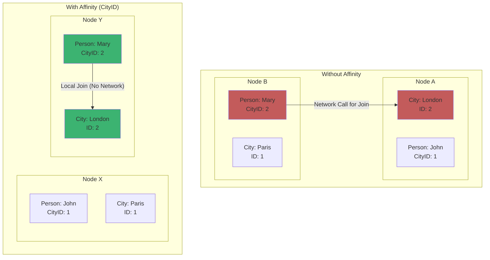
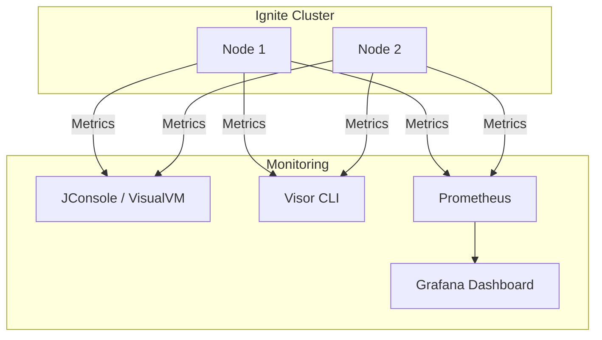

# Chapter 5: 성능 최적화와 모니터링

## 📖 학습 목표
이 챕터를 완료하면 다음을 할 수 있습니다:
- Ignite 클러스터의 성능에 영향을 미치는 주요 요소를 이해하고 튜닝할 수 있습니다.
- Ignite가 제공하는 모니터링 도구를 사용하여 클러스터의 상태를 확인할 수 있습니다.
- 기본적인 클러스터 관리 및 트러블슈팅 방법을 설명할 수 있습니다.

## 📋 목차
1. 성능 튜닝 가이드
2. 모니터링 도구 활용
3. 클러스터 관리 및 트러블슈팅
4. 확인 문제

---

## 1. 성능 튜닝 가이드

Ignite는 고성능을 목표로 설계되었지만, 애플리케이션의 특성과 데이터 모델에 맞게 설정을 최적화해야 최대 성능을 발휘할 수 있습니다.

### 주요 성능 튜닝 포인트

1.  **메모리 설정 (Off-Heap vs On-Heap)**
    -   **권장**: 대부분의 데이터를 **Off-Heap**에 저장하세요. 이는 챕터 2에서 설명했듯이 Java의 GC(Garbage Collection)로 인한 성능 저하를 방지하는 가장 중요한 설정입니다.
    -   `DataRegionConfiguration`을 통해 Off-Heap 메모리의 크기, 영속성 여부 등을 세밀하게 조정할 수 있습니다.

2.  **인덱싱 (Indexing)**
    -   **필수**: SQL 쿼리를 사용하는 경우, `WHERE` 절에 사용되는 필드에는 반드시 **인덱스**를 생성해야 합니다. 인덱스가 없으면 Full-Scan이 발생하여 쿼리 속도가 급격히 느려집니다. (`@QuerySqlField(index = true)`)

3.  **데이터 지역성 (Data Affinity)**
    -   **개념**: 연관된 데이터를 동일한 노드에 배치하여 네트워크 통신 비용을 줄이는 기술입니다. 예를 들어, '도시(City)'와 해당 도시에 사는 '사람(Person)' 데이터를 함께 조회하는 경우가 많다면, `AffinityKey`를 사용하여 동일한 노드에 저장할 수 있습니다.
    -   **효과**: 여러 데이터를 조인(Join)하는 SQL 쿼리의 성능을 극적으로 향상시킬 수 있습니다.

4.  **스레드 풀 튜닝**
    -   Ignite는 내부적으로 다양한 목적(쿼리 실행, 데이터 관리 등)을 위한 여러 스레드 풀을 사용합니다. 시스템의 CPU 코어 수와 작업 부하에 맞게 각 스레드 풀의 크기를 조정하면 처리량을 높일 수 있습니다. (`IgniteConfiguration`에서 설정)

### 시각적 자료: 데이터 지역성 (Affinity)

> **💡 팁: 점진적인 최적화**
> 

> 처음부터 모든 설정을 완벽하게 맞추려고 하기보다는, 먼저 기본 설정으로 시스템을 구축한 뒤 부하 테스트를 통해 병목 지점을 찾아내고, 해당 부분을 중심으로 점진적으로 튜닝해나가는 것이 효과적입니다.
> 

---

## 2. 모니터링 도구 활용

클러스터가 안정적으로 운영되고 있는지, 성능 저하의 원인은 무엇인지 파악하려면 지속적인 모니터링이 필수적입니다.

### 주요 모니터링 방법

1.  **JMX (Java Management Extensions)**
    -   Java 애플리케이션을 모니터링하고 관리하는 표준 기술입니다.
    -   `JConsole`, `VisualVM`과 같은 JMX 클라이언트를 사용하여 Ignite 노드의 CPU 사용량, 메모리 상태, 캐시 크기, 쿼리 실행 통계 등 수많은 정보를 실시간으로 확인할 수 있습니다.

2.  **Ignite Visor CLI**
    -   Ignite가 제공하는 커맨드 라인 기반의 관리 및 모니터링 도구입니다.
    -   `ignite-visor-cli` 스크립트를 실행하여 클러스터에 연결한 뒤, `node`, `cache`, `top` 같은 명령어로 클러스터의 전반적인 상태를 텍스트 기반으로 확인할 수 있습니다.

3.  **서드파티 모니터링 시스템 연동**
    -   Ignite는 `Prometheus`, `Zabbix`, `Datadog` 등 널리 사용되는 모니터링 시스템과 쉽게 연동할 수 있는 익스포터(Exporter)를 제공합니다.
    -   이를 통해 기존에 사용하던 모니터링 대시보드에 Ignite의 상태 지표를 통합하여 관리할 수 있습니다.

### 시각적 자료: 모니터링 시스템 연동

> **✅ 성공 포인트: 어떤 도구를 사용해야 할까?**
> 

> -   **개발 중**이거나 **빠른 진단**이 필요할 때는 `JConsole`이나 `VisualVM`이 편리합니다.
> -   **운영 환경**에서는 `Prometheus`와 `Grafana` 조합과 같이 시계열 데이터를 저장하고 시각화하는 전문 모니터링 시스템을 구축하여 장기적인 성능 추이를 분석하는 것이 좋습니다.
> 

---

## 3. 클러스터 관리 및 트러블슈팅

### 클러스터 활성화
Ignite 클러스터는 기본적으로 비활성(inactive) 상태로 시작됩니다. 이 상태에서는 데이터 조작이나 쿼리가 불가능합니다. 클러스터를 사용하려면 반드시 **활성화(activation)**해야 합니다.

-   **Visor CLI 사용**: `cluster --activate`
-   **Java API 사용**: `ignite.cluster().active(true)`

### 주요 트러블슈팅 시나리오

1.  **OutOfMemoryError 발생**
    -   **원인**: Off-Heap 또는 On-Heap 메모리가 부족할 경우 발생합니다.
    -   **해결**: `DataRegionConfiguration`에서 Off-Heap 크기를 늘리거나, JVM 옵션(`-Xmx`)에서 On-Heap 크기를 늘려줍니다. 데이터 모델을 검토하여 불필요한 데이터를 줄이는 것도 중요합니다.

2.  **노드가 클러스터에 참여하지 못함**
    -   **원인**: 네트워크 문제(방화벽 등) 또는 설정 오류(`DiscoverySpi`)로 인해 노드들이 서로를 발견하지 못하는 경우입니다.
    -   **해결**: 노드 간 네트워크 연결이 정상적인지 확인하고, 모든 노드의 클러스터 이름과 `DiscoverySpi` 설정이 동일한지 검토합니다.

3.  **느린 SQL 쿼리**
    -   **원인**: 대부분 인덱스가 없거나, 잘못된 인덱스를 사용하기 때문입니다. 데이터 지역성이 고려되지 않은 분산 조인도 원인이 될 수 있습니다.
    -   **해결**: `EXPLAIN SELECT ...` 쿼리를 실행하여 쿼리 실행 계획을 분석하고, 필요한 인덱스를 추가합니다. 관련 데이터를 함께 조회하는 경우가 많다면 `AffinityKey` 사용을 검토합니다.

> **⚠️ 주의사항: 로그 파일 확인**
> 

> 문제가 발생했을 때 가장 먼저 확인해야 할 것은 **Ignite 노드의 로그 파일**입니다. 로그에는 에러의 원인과 관련된 상세한 정보, 스택 트레이스 등이 기록되어 있어 문제 해결의 결정적인 단서가 됩니다.
> 

---

## ✅ 확인 문제

### 문제 1 (단일 선택)
SQL 쿼리 성능을 높이기 위해 `WHERE` 절에 사용되는 필드에 반드시 설정해야 하는 것은 무엇입니까?

1. 트랜잭션 (Transaction)
2. 인덱스 (Index)
3. 복제 (Replication)
4. 스레드 풀 (Thread Pool)

### 문제 2 (복수 선택)
Ignite 클러스터의 상태를 모니터링하는 데 사용할 수 있는 도구를 모두 선택하세요.

1. JConsole
2. VisualVM
3. Ignite Visor CLI
4. Node.js

### 문제 3 (단일 선택)
관련 있는 데이터를 동일한 노드에 배치하여 네트워크 비용을 줄이고 조인 성능을 향상시키는 Ignite의 기술은 무엇입니까?

1. 데이터 파티셔닝 (Data Partitioning)
2. 데이터 지역성 (Data Affinity)
3. 데이터 복제 (Data Replication)
4. 데이터 영속성 (Data Persistence)

---

## 📚 정리

### 핵심 내용 요약
- Ignite 성능은 **메모리 설정, 인덱싱, 데이터 지역성** 등 다양한 요소를 튜닝하여 최적화할 수 있습니다.
- **JMX, Visor CLI, Prometheus 연동** 등 다양한 도구를 사용하여 클러스터 상태를 지속적으로 모니터링해야 합니다.
- 클러스터는 사용 전에 반드시 **활성화**해야 하며, 문제 발생 시 **로그 파일**을 확인하는 것이 트러블슈팅의 첫걸음입니다.

### 과정 마무리
이것으로 Apache Ignite 기초 학습 가이드의 모든 챕터를 마칩니다. 여러분은 이제 Ignite의 핵심 개념을 이해하고, Java 및 웹 애플리케이션에 이를 통합하며, 기본적인 성능 최적화와 모니터링을 수행할 수 있는 기초를 다졌습니다.

---

## 🔗 참고 자료
- [Apache Ignite Docs: Performance and Tuning](https://ignite.apache.org/docs/latest/performance/jvm-and-system-tuning)
- [Apache Ignite Docs: Monitoring and Management](https://ignite.apache.org/docs/latest/tools/monitoring-management)

