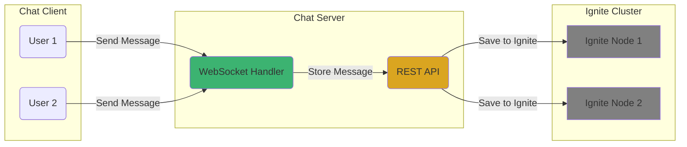
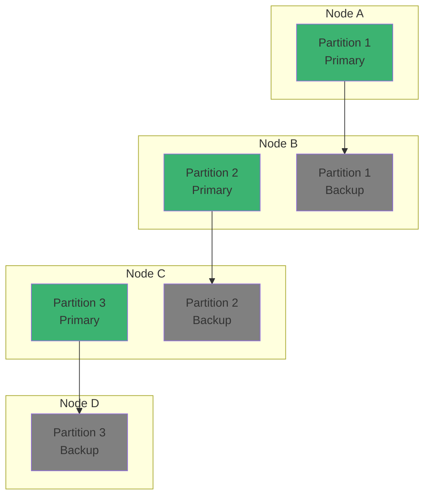

# Chapter 6: 웹소켓 기반 채팅 서버와 Ignite 메시지 저장 서버 연동 및 클러스터링

## 📖 학습 목표
이 챕터를 완료하면 다음을 할 수 있습니다:
- 웹소켓 기반 채팅 서버의 구조와 역할을 이해할 수 있습니다.
- Ignite 메시지 저장 서버와의 연동 구조 및 분리 이유를 설명할 수 있습니다.
- Ignite 메시지 저장 서버 구축 방법과 구동 원리를 이해할 수 있습니다.
- Ignite 클러스터링의 정의와 실제 예시를 설명할 수 있습니다.
- 실습 예제를 통해 채팅 메시지 저장/조회 기능을 구현할 수 있습니다.

## 📋 목차
1. 웹소켓과 채팅 서버의 구조
2. Ignite 메시지 저장 서버와의 연동 및 분리 이유
3. Ignite 메시지 저장 서버 구축 방법 및 구동 원리
4. Ignite 클러스터링의 정의와 예시
5. 실습 예제: 채팅 메시지 저장/조회
6. 확인 문제

---

## 1. 웹소켓과 채팅 서버의 구조

### 개념 설명
웹소켓(WebSocket)은 클라이언트와 서버 간에 실시간 양방향 통신을 가능하게 하는 프로토콜입니다. HTTP와 달리, 연결이 유지된 상태에서 메시지를 주고받을 수 있어 실시간 채팅, 게임, 알림 등에 적합합니다.

Node.js/Express 환경에서 웹소켓 서버를 구축할 때는 `ws` 또는 `socket.io` 라이브러리를 주로 사용합니다.

### 시각적 자료


---

## 2. Ignite 메시지 저장 서버와의 연동 및 분리 이유

### 분리하는 이유
- **확장성**: 채팅 서버와 메시지 저장 서버를 분리하면 각각 독립적으로 확장할 수 있습니다.
- **장애 격리**: 한쪽 서버에 장애가 발생해도 전체 서비스가 중단되지 않습니다.
- **데이터 영속성**: Ignite는 메시지를 메모리와 디스크에 안전하게 저장하여 장애 복구가 가능합니다.
- **실시간 처리와 저장 분리**: 채팅 서버는 실시간 메시지 전달에 집중, Ignite 서버는 데이터 저장과 조회에 집중합니다.

### 데이터 흐름
1. 클라이언트가 웹소켓을 통해 채팅 메시지 전송
2. 채팅 서버가 메시지를 받아 Ignite 메시지 저장 서버에 저장 요청(API 또는 Ignite 클라이언트)
3. 저장된 메시지는 필요 시 조회 API를 통해 클라이언트에 전달

---

## 3. Ignite 메시지 저장 서버 구축 방법 및 구동 원리

### 구축 방법 (macOS 기준, 최신 버전)
1. **Java 설치**: OpenJDK 11 이상 권장
2. **Ignite 다운로드**: [공식 사이트](https://ignite.apache.org/download.html)에서 최신 버전 다운로드
3. **압축 해제 및 실행**:
   - `tar -xzf apache-ignite-<version>-bin.tar.gz`
   - `cd apache-ignite-<version>-bin`
   - `./bin/ignite.sh`
4. **클러스터 구성**: 여러 노드에서 ignite.sh를 실행하면 자동으로 클러스터링됨

> **최신 버전 호환성**: Ignite 3.x는 기존 2.x와 API가 다르므로, 실무에서는 2.16.x LTS 버전 사용을 권장합니다. 3.x 사용 시 공식 문서에서 호환성 확인 필요.

### 구동 원리
- 각 Ignite 노드는 데이터를 메모리에 저장하고, 필요 시 디스크에 영속화
- 클러스터 내 노드들은 파티션/복제 방식으로 데이터를 분산 저장
- 장애 발생 시, 복제본을 통해 데이터 복구

---

## 4. Ignite 클러스터링의 정의와 예시

### 정의
클러스터링은 여러 서버(노드)가 하나의 논리적 데이터 저장소처럼 동작하도록 구성하는 기술입니다. 데이터 분산, 복제, 장애 복구, 확장성 확보가 목적입니다.

### 시각적 자료


---

## 5. 실습 예제: 채팅 메시지 저장/조회

### Node.js 웹소켓 서버에서 Ignite 메시지 저장 서버 연동 예시

```javascript
// 파일 경로: src/server/chatServer.js
// Node.js 기반 웹소켓 채팅 서버에서 Ignite REST API로 메시지 저장
const WebSocket = require('ws');
const axios = require('axios');

const wss = new WebSocket.Server({ port: 8081 });

wss.on('connection', ws => {
    ws.on('message', async message => {
        // 1. 클라이언트로부터 메시지 수신
        // 2. Ignite REST API로 메시지 저장
        await axios.get('http://localhost:8080/ignite', {
            params: {
                cmd: 'put',
                cacheName: 'chatCache',
                key: Date.now(), // 메시지의 고유 키(타임스탬프)
                val: message
            }
        });
        // 3. 모든 클라이언트에 메시지 브로드캐스트
        wss.clients.forEach(client => {
            if (client.readyState === WebSocket.OPEN) {
                client.send(message);
            }
        });
    });
});
```

### Ignite 메시지 조회 예시 (Node.js)
```javascript
// 파일 경로: src/server/fetchMessages.js
const axios = require('axios');

async function fetchMessages() {
    const response = await axios.get('http://localhost:8080/ignite', {
        params: {
            cmd: 'qryfldexe',
            cacheName: 'chatCache',
            pageSize: 100,
            qry: 'SELECT _key, _val FROM String'
        }
    });
    return response.data.response.items;
}
```

---

## 🔧 실습 예제: 웹소켓 채팅 서버와 Ignite 메시지 저장 (Java/Spring, Kotlin/Spring)

### Java(Spring) 예제
```java
// 파일 경로: src/main/java/com/example/ignite/ChatServer.java
package com.example.ignite;

import org.springframework.stereotype.Controller;
import org.springframework.web.bind.annotation.MessageMapping;
import org.springframework.web.bind.annotation.SendTo;
import org.springframework.web.socket.config.annotation.EnableWebSocketMessageBroker;
import org.springframework.messaging.handler.annotation.Payload;
import org.springframework.messaging.handler.annotation.SendTo;
import org.springframework.messaging.simp.SimpMessagingTemplate;
import org.apache.ignite.Ignite;
import org.apache.ignite.Ignition;
import org.apache.ignite.IgniteCache;
import org.apache.ignite.configuration.CacheConfiguration;
import org.springframework.context.annotation.Configuration;
import org.springframework.web.socket.config.annotation.WebSocketMessageBrokerConfigurer;
import org.springframework.web.socket.config.annotation.StompEndpointRegistry;

// WebSocket 설정 클래스
@Configuration
@EnableWebSocketMessageBroker
class WebSocketConfig implements WebSocketMessageBrokerConfigurer {
    @Override
    public void registerStompEndpoints(StompEndpointRegistry registry) {
        // 클라이언트가 연결할 엔드포인트 등록
        registry.addEndpoint("/chat").setAllowedOrigins("*").withSockJS();
    }
}

// 채팅 메시지 컨트롤러
@Controller
public class ChatController {
    private final SimpMessagingTemplate messagingTemplate;
    private final IgniteCache<Long, String> chatCache;

    public ChatController(SimpMessagingTemplate messagingTemplate) {
        this.messagingTemplate = messagingTemplate;
        // Ignite 클라이언트 노드 시작 및 캐시 생성
        Ignite ignite = Ignition.start();
        CacheConfiguration<Long, String> cacheCfg = new CacheConfiguration<>();
        cacheCfg.setName("chatCache");
        this.chatCache = ignite.getOrCreateCache(cacheCfg);
    }

    // 클라이언트가 메시지를 보내면 이 메서드가 호출됨
    @MessageMapping("/send")
    @SendTo("/topic/messages")
    public String sendMessage(@Payload String message) {
        // 메시지를 Ignite에 저장 (타임스탬프를 키로 사용)
        chatCache.put(System.currentTimeMillis(), message);
        // 모든 클라이언트에 메시지 브로드캐스트
        messagingTemplate.convertAndSend("/topic/messages", message);
        return message;
    }
}
```

### Kotlin(Spring) 예제
```kotlin
// 파일 경로: src/main/kotlin/com/example/ignite/ChatServer.kt
package com.example.ignite

import org.springframework.stereotype.Controller
import org.springframework.web.bind.annotation.MessageMapping
import org.springframework.web.bind.annotation.SendTo
import org.springframework.web.socket.config.annotation.EnableWebSocketMessageBroker
import org.springframework.messaging.handler.annotation.Payload
import org.springframework.messaging.simp.SimpMessagingTemplate
import org.apache.ignite.Ignition
import org.apache.ignite.configuration.CacheConfiguration
import org.springframework.context.annotation.Configuration
import org.springframework.web.socket.config.annotation.WebSocketMessageBrokerConfigurer
import org.springframework.web.socket.config.annotation.StompEndpointRegistry

@Configuration
@EnableWebSocketMessageBroker
class WebSocketConfig : WebSocketMessageBrokerConfigurer {
    override fun registerStompEndpoints(registry: StompEndpointRegistry) {
        // 클라이언트가 연결할 엔드포인트 등록
        registry.addEndpoint("/chat").setAllowedOrigins("*").withSockJS()
    }
}

@Controller
class ChatController(private val messagingTemplate: SimpMessagingTemplate) {
    private val chatCache = Ignition.start().getOrCreateCache<Long, String>(CacheConfiguration<Long, String>().apply {
        name = "chatCache"
    })

    // 클라이언트가 메시지를 보내면 이 메서드가 호출됨
    @MessageMapping("/send")
    @SendTo("/topic/messages")
    fun sendMessage(@Payload message: String): String {
        // 메시지를 Ignite에 저장 (타임스탬프를 키로 사용)
        chatCache.put(System.currentTimeMillis(), message)
        // 모든 클라이언트에 메시지 브로드캐스트
        messagingTemplate.convertAndSend("/topic/messages", message)
        return message
    }
}
```

> **파일 위치 설명**: 채팅 서버 및 메시지 저장 예제는 src/main/java 또는 src/main/kotlin 하위에 위치합니다. SpringBoot에서는 WebSocket 설정은 Configuration, 메시지 처리 로직은 Controller에 구현하는 것이 표준입니다.

---

## 6. 확인 문제

### 문제 1 (단일 선택)
웹소켓 기반 채팅 서버와 Ignite 메시지 저장 서버를 분리하는 주요 이유로 올바른 것은?

1. 코드가 더 짧아진다
2. 장애 격리와 확장성 확보
3. 클러스터링이 불가능하다
4. 실시간 처리가 느려진다

### 문제 2 (복수 선택)
Ignite 클러스터링의 특징으로 올바른 것을 모두 선택하세요.

1. 데이터가 여러 노드에 분산 저장된다
2. 장애 발생 시 복제본을 통해 데이터 복구가 가능하다
3. 모든 데이터가 한 노드에만 저장된다
4. 노드 추가 시 전체 용량이 증가한다

### 문제 3 (단일 선택)
Node.js 기반 채팅 서버에서 Ignite 메시지 저장 서버에 메시지를 저장할 때 주로 사용하는 방식은?

1. 직접 파일에 저장
2. Ignite REST API 호출
3. SQL 데이터베이스 직접 연결
4. 클라이언트에만 저장

---

## 📚 정리

### 핵심 내용 요약
- 웹소켓 기반 채팅 서버는 실시간 메시지 전달에 특화되어 있으며, Ignite 메시지 저장 서버와 연동해 데이터 영속성을 확보합니다.
- 두 서버를 분리하면 확장성, 장애 격리, 데이터 안정성 등 실무에서 중요한 장점을 얻을 수 있습니다.
- Ignite 클러스터링은 데이터 분산, 복제, 장애 복구, 확장성을 제공하며, 실무에서는 2.16.x LTS 버전 사용을 권장합니다.
- Node.js/Express 환경에서도 Ignite REST API를 통해 메시지 저장/조회가 가능합니다.

### 참고 자료
- [Apache Ignite 공식 문서](https://ignite.apache.org/docs/latest/)
- [Ignite REST API](https://ignite.apache.org/docs/latest/restapi/rest-api)
- [Node.js ws 라이브러리](https://github.com/websockets/ws)
